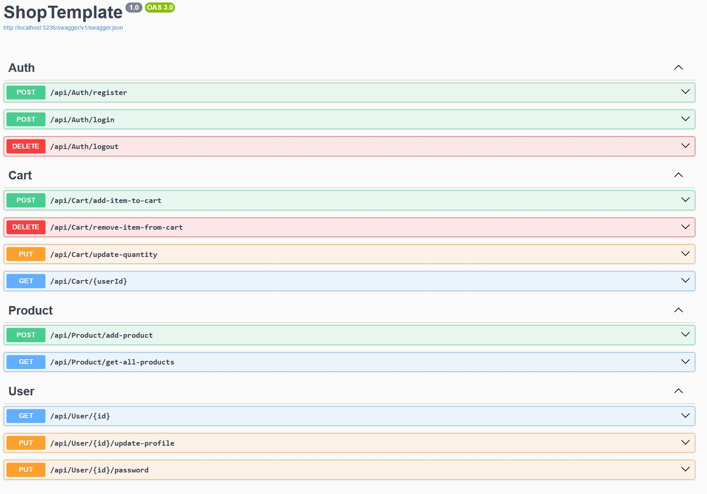

# ShopTemplate API

A simple e-commerce backend built with ASP.NET Core 8 and MySQL, supporting users, products, and shopping cart functionality. Real-time cart updates are powered by SignalR.

## Table of Contents

1. [Requirements](#requirements)
2. [Features](#features)
3. [Global Exception Handling](#global-exception-handling)
4. [API Endpoints](#api-endpoints)
5. [SignalR](#signalr)
6. [Notes](#notes)
7. [Setup Database](#setup-database)
8. [API Example](#api-example)
9. [Running project with migrations](#running-project-with-migrations)

---

## Requirements

- .NET 8 SDK
- MySQL Server
## Features

- **User Authentication**: Register, login, logout.
- **Products**: Add and list products with pagination. 
- **Shopping Cart**: Add/remove items, update quantity, cart total auto-calculates.
- **Real-time updates**: Cart changes broadcasted to clients via SignalR.
- **Error handling**: Consistent API responses with FluentResults.
- Unit tests are provided for `AuthService` using xUnit.

<u>Some endpoints are not fully implemented</u> (e.g., `Logout`, `UpdateUser`, `ChangePassword`).

## Global Exception Handling

All unhandled exceptions are caught by `ExceptionHandlingMiddleware`:

- Logs errors using ASP.NET Core `ILogger`.
- Returns a standardized `ProblemDetails` JSON response with `500 Internal Server Error`.
- Ensures consistent server-side error handling across the API.

## API Endpoints

- `POST /api/auth/register` – create a new user
- `POST /api/auth/login` – login user
- `POST /api/products/add-product` – add a new product
- `GET /api/products/get-all-products` – get paged list of products
- `POST /api/cart/add-item-to-cart` – add item to cart
- `DELETE /api/cart/remove-item-from-cart` – remove item from cart
- `POST /api/cart/update-quantity` – update item quantity
- `GET /api/cart/{userId}` – get cart by user

## SignalR

- Hub: `/cartHub`
- Method: `ReceiveCartUpdate(cartDto)` – called when cart changes.

## Notes

- Cart persists via API (server-side).
- Passwords hashed securely with PBKDF2 + SHA256.
- Error codes follow `FailureTypes` enum for consistent handling.
- A default test user is seeded on database initialization:  
  **Username:** `TestUsername`  
  **Password:** `TestPassword`
- Sample products and an initial empty cart for the test user are also seeded.

## API Example

Here is a preview of requests in Postman:


## Setup Database

1. Install MySQL (if not installed) and start the service.
2. Update the connection string in `appsettings.json`:

```json
"ConnectionStrings": {
"DefaultConnection": "Server=localhost;Database=ShopTemplateDB;User Id=sa;Password=gg232412abb22#306!843;"
}
```

## Running project with migrations
For migrations, you should open a terminal in the project folder and run:
```bash
dotnet tool install --global dotnet-ef
dotnet restore
dotnet ef migrations add InitialCreate
dotnet ef database update
```
After you can launch project:
```bash
dotnet run
```